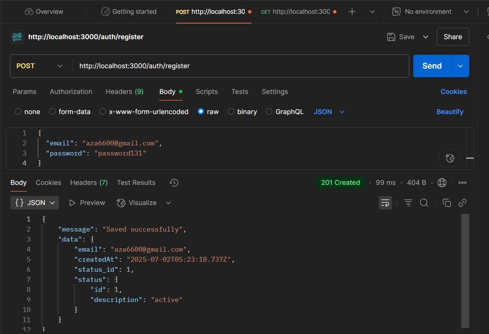

# Standarisasi Response API di NestJS

Dokumentasi ini menjelaskan pendekatan standarisasi response API menggunakan helper dalam eksplorasi NestJS.

## Pendekatan Helper

NestJS mendukung berbagai pendekatan untuk membuat helper. Dalam konteks standarisasi response API, terdapat dua pendekatan utama:

1. Helper Function  
2. Interceptor

Proyek ini menggunakan pendekatan interceptor karena sifatnya yang terintegrasi dengan lifecycle NestJS dan penerapan secara global tanpa perlu dipanggil manual di setiap controller.

## Struktur Response

Struktur response yang digunakan terdiri dari tiga properti utama:

- `status`  
- `message`  
- `data`

Nilai `message` akan disesuaikan berdasarkan metode HTTP yang digunakan (`GET`, `POST`, `PUT`, `DELETE`).

## Lokasi dan Implementasi Interceptor

Implementasi interceptor dapat ditemukan di:

**File:**  
`src/common/interceptors/response.interceptor.ts`

**Class:**  
`ResponseInterceptor`

**Method:**  
`intercept(context: ExecutionContext, next: CallHandler)`

Interceptor ini membaca metode HTTP dari objek request dan menyesuaikan pesan yang dikembalikan sesuai kebutuhan. Jika response mengandung error (status code 400 ke atas), maka response tersebut tidak dimodifikasi.

## Penggunaan Interceptor Secara Global

Agar interceptor bekerja untuk semua endpoint, maka perlu didaftarkan secara global di file:

**File:**  
`src/main.ts`

**Fungsi:**  
`bootstrap()`

Di dalam fungsi ini, instance dari `ResponseInterceptor` didaftarkan menggunakan method `useGlobalInterceptors`.

## Contoh Penggunaan di Endpoint

Sebagai contoh, endpoint /register user dapat ditemukan pada:

**File:**  
`src/modules/auth/auth.controller.ts`

**Method:**  
`register(@Body() dto: RegisterAuthDto)`

Method ini akan tetap mengembalikan struktur response mentah, namun akan dibungkus oleh `ResponseInterceptor` sehingga client menerima format yang telah distandarisasi.

## Dokumentasi Swagger

Swagger telah diaktifkan untuk dokumentasi otomatis API dan dapat diakses pada: http://localhost:3000/api

---

## Contoh Endpoint Lain

Berikut beberapa endpoint yang juga mengikuti standar response:

- **GET** `/users`  
  Mengambil seluruh data user

- **GET** `/users/:id`  
  Mengambil satu user berdasarkan ID

- **POST** `/users`  
  Menambahkan user baru

- **PUT** `/users/:id`  
  Memperbarui data user berdasarkan ID

- **DELETE** `/users/:id`  
  Menghapus user berdasarkan ID

---

## Catatan

- Semua response endpoint akan mengikuti format standar:  
  ```json
  {
    "status": true,
    "message": "Data retrieved successfully",
    "data": { ... }
  }

